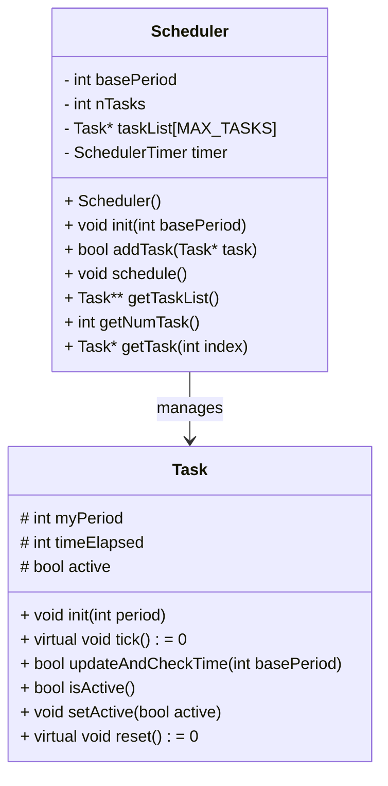
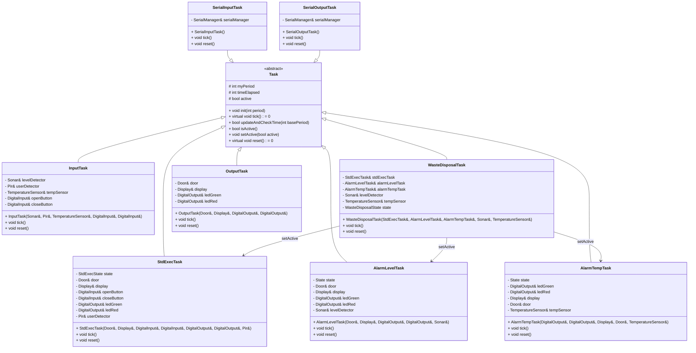
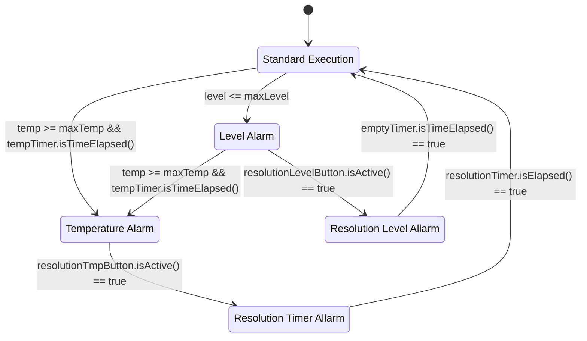
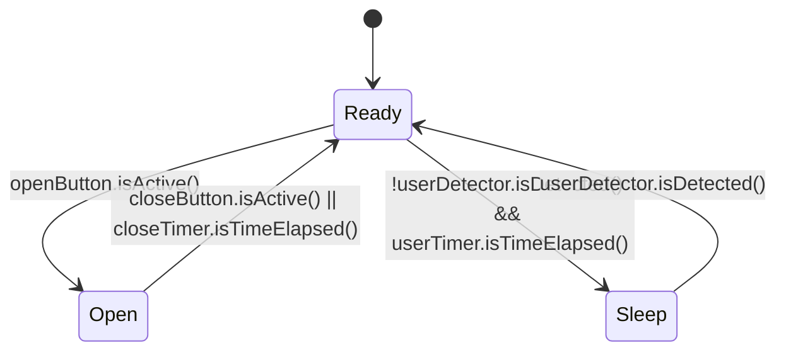
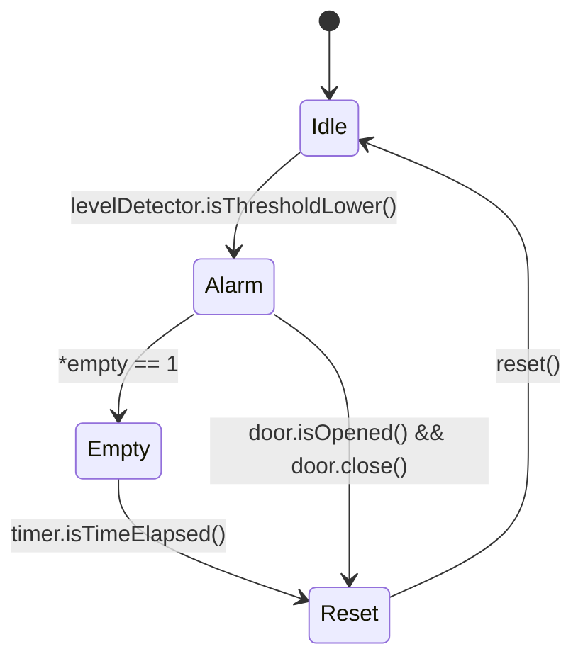

# Relazione del Progetto-2 
## Design
### Relazione tra Sheduler e Task
Il design globale del progetto si basa su di una architettura a `Task` amministrate da uno `Scheduler` che le amminaistra sulla dase dei loro periodi base.

#### Dettagli del Diagramma:
1. `Scheduler`:
   - Ha una relazione con `Task` tramite l'array `taskList`, che può contenere fino a `MAX_TASKS` oggetti `Task`.
   - Invoca i metodi delle istanze di `Task` attraverso il metodo `schedule`.
2. `Task`:
   - Interfaccia base contenete i metodi `tick` e `reset`, essi verrano implementati delle specifiche task.

### Interoperatività delle Task
Le task `InputTask`, `WasteDisposalTask`, `StdExecTask`, `AlarmLevelTask`, `AlarmTempTask`, e `OutputTask` sono implementazioni della classe astratta `Task`. Esse sono contenute nella `taskList` dello `Scheduler` e chiamate da quest'ultimo sulla base del loro stato di attività. Lo stato di attività delle task `StdExecTask`, `AlarmLevelTask` e `AlarmTempTask` è amministrato dalla task di menagment `WasteDisposalTask`

#### Dettagli del Diagramma:
1. **Ereditarietà**:
   - Tutte le task derivano dalla classe astratta `Task`.

2. **Dipendenze**:
   - `WasteDisposalTask` gestisce le sotto-task (`StdExecTask`, `AlarmLevelTask`, `AlarmTempTask`) e utilizza componenti come `Sonar` e `TemperatureSensor`.
   - `InputTask` legge sensori come `Sonar`, `Pir`, `TemperatureSensor` e interagisce con gli input digitali.
   - Altre task (es. `AlarmLevelTask`, `AlarmTempTask`) controllano output (es. LED, display) e interagiscono con i sensori o attuatori (es. `Door`, `Sonar`, `TemperatureSensor`).
   - `SerialInputTask` e `SerialOutputTask` dipendono da `SerialManager` e lo utilizzano per gestire le operazioni seriali.

### Diagrammi a Stati delle Task

#### WasteDisposalTask

#### StdExecTask

#### AllarmLevelTask

(DA SISTEMARE GLI IF)

#### AllarmTempTask

(DIAGRAMMA)